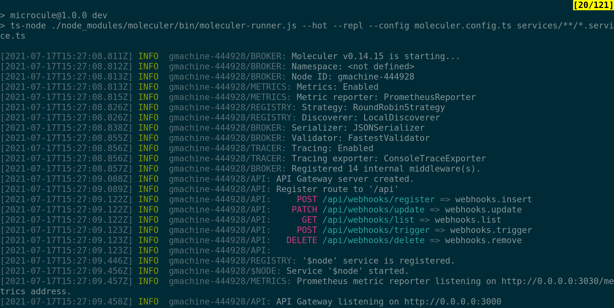
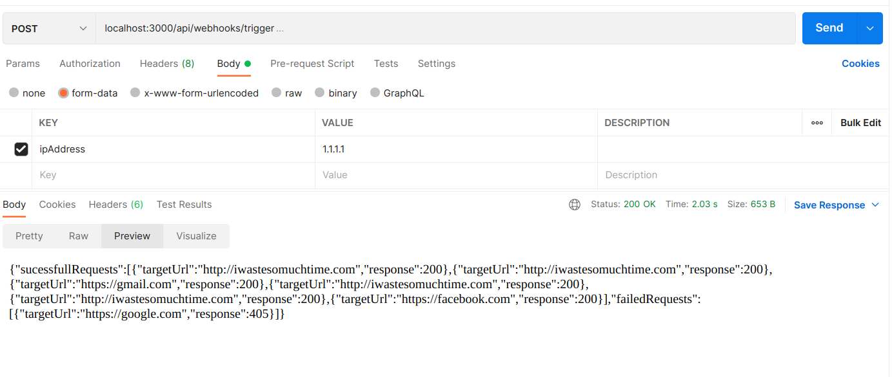

# myCrowService
This is a [Moleculer](https://moleculer.services/)-based microservices project. Generated with the [Moleculer CLI](https://moleculer.services/docs/0.14/moleculer-cli.html). Webhooks Microservice using  Moleculer 

## Usage
Start the project with `npm run dev` command.

## Available Endpoints
- POST /api/webhooks/register => webhooks.insert
- PATCH /api/webhooks/update => webhooks.update
- GET /api/webhooks/list => webhooks.list
- POST /api/webhooks/trigger => webhooks.trigger
- DELETE /api/webhooks/delete => webhooks.remove

## Services
- **api**: API Gateway services
- **webhooks**: Webhook service 
## NPM scripts

- `npm run dev`: Start development mode (load all services locally with hot-reload & REPL)
- `npm run start`: Start production mode (set `SERVICES` env variable to load certain services)
- `npm run cli`: Start a CLI and connect to production. Don't forget to set production namespace with `--ns` argument in script
- `npm run lint`: Run ESLint
- `npm run ci`: Run continuous test mode with watching
- `npm run dc:up`: Start the stack with Docker Compose
- `npm run dc:down`: Stop the stack with Docker Compose

## Screenshots
Moleculer output

Trigger action

